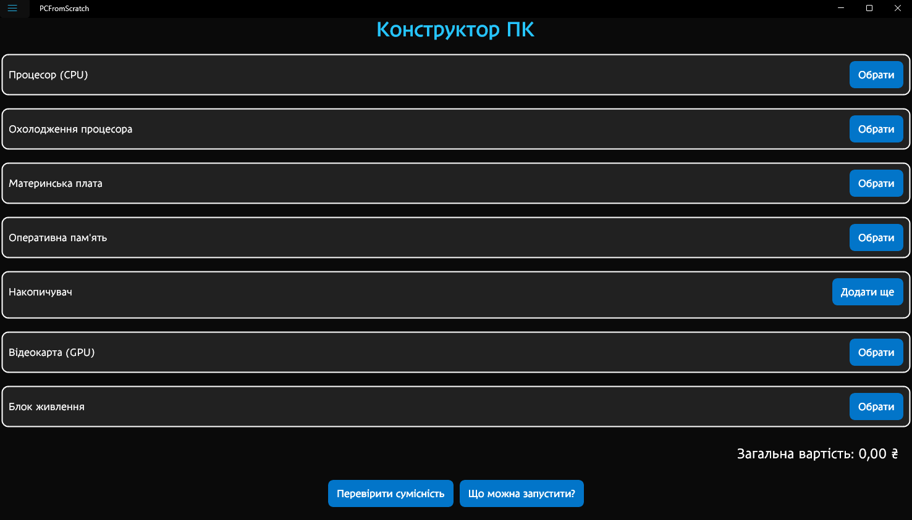
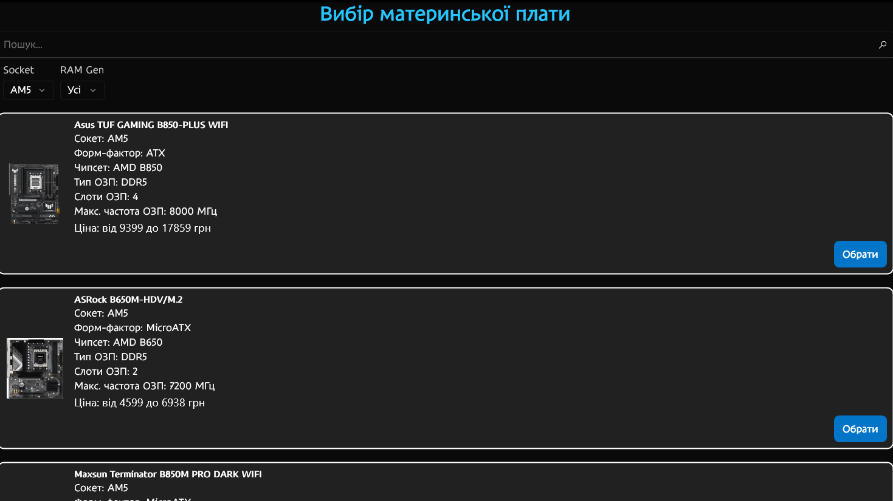
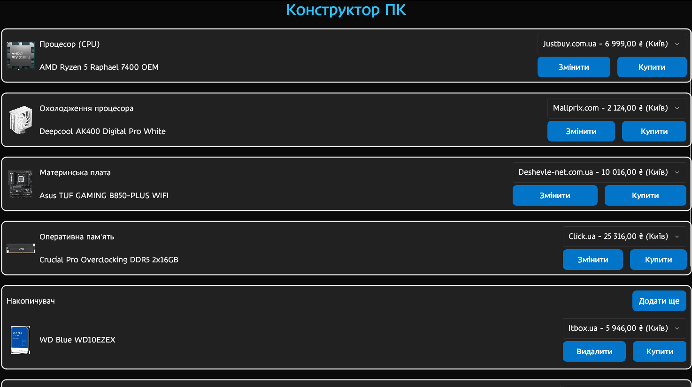
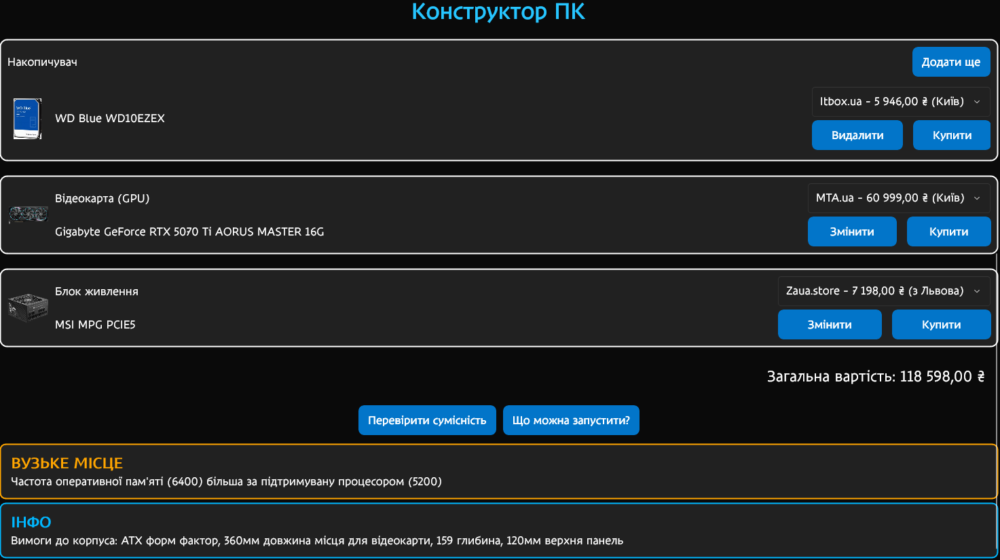
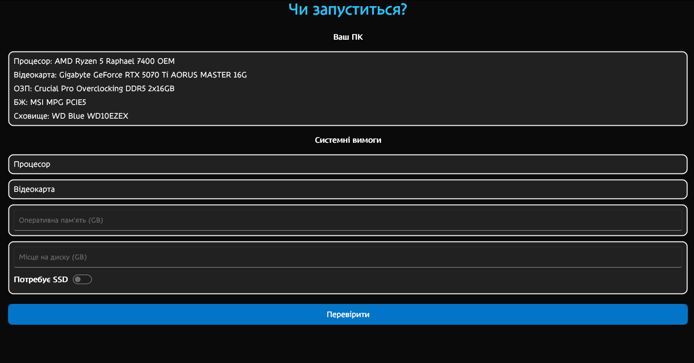
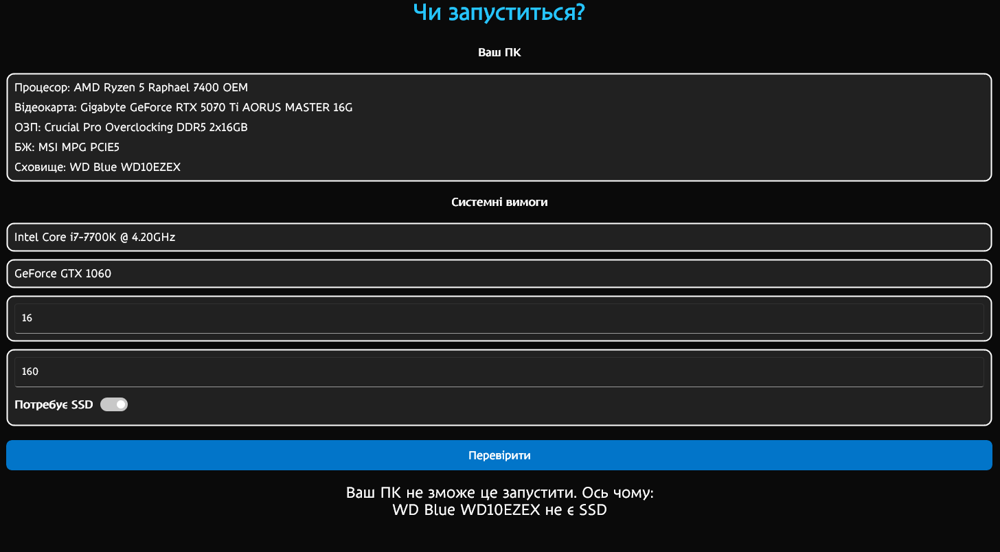
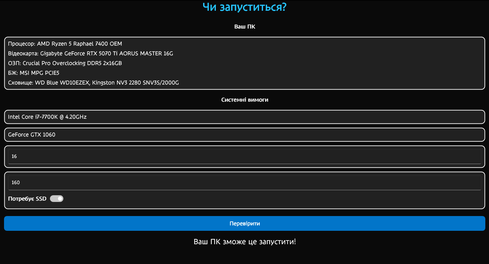
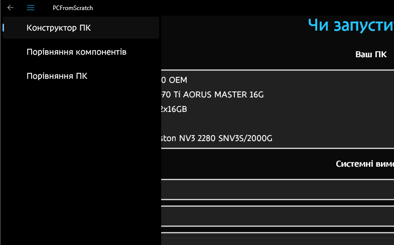
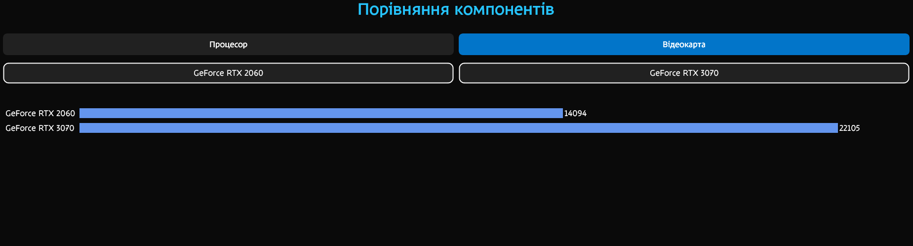
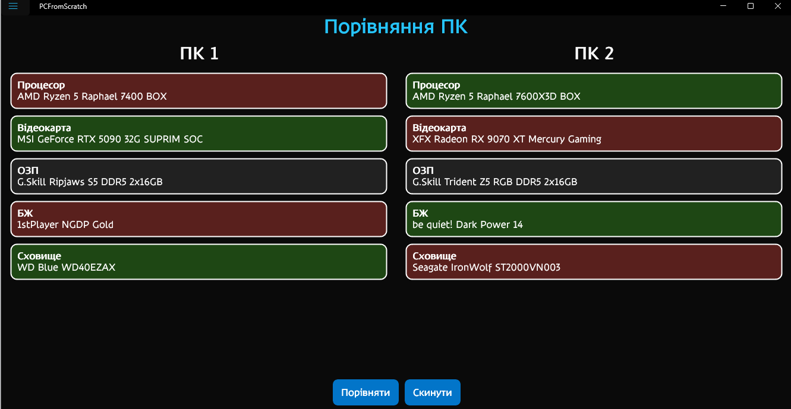

# Інструкція користувача до застосунку PCFromScratch

## Розгортання сервера

- Для розгортання сервера необхідні .NET SDK 10, PowerShell, Docker та Docker Compose. Ідеальним середовищем є Linux, проте можна також запускати Docker через WSL2 на Windows.

- Клонуйте серверний застосунок через `git clone -b server https://github.com/afiliushkin/PCFromScratch.git`

- Запустіть Docker `sudo systemctl start docker`. Найкращим варіантом буде запускати його під час запуску системи `sudo systemctl enable docker --now`

- У директорії проекту введіть `docker compose up -d`

- Перейдіть у PCFromScratch.API і запустіть сервер `dotnet run`

- Сервер завантажить браузери для Playwright, після чого почне скрейпінг. За бажанням вкладки можна закрити в будь який момент, вже прочитані компоненти будуть збережені до бази даних, що може значно пришвидшити тестування.

- Сервер готовий до роботи.

## Встановлення застосунку

- Застосунок працює на Windows та Android, для компіляції необхідні .NET SDK 10 та MAUI `dotnet workload install maui`. Для компіляції під Android також необхідні Android SDK і JDK 21.

- Клонуйте клієнтський застосунок через `git clone -b client https://github.com/afiliushkin/PCFromScratch.git`

- Через те що ми не можемо передбачити ip-адресу розгорнутого сервера, її необхідно буде вказати у appsettings.json

- Скомпілюйте і запустіть застосунок, це можна зробити через консоль командами

`dotnet run -f net10.0-windows10.0.19041.0 -p:WindowsPackageType=None` для Windows

`dotnet build -t:Run -f net10.0-android` для Android за умови налаштованого Android Debug Bridge

Також можна запустити через IDE (Visual Studio/Rider), або створити apk/msix/exe файли і встановити їх на бажаному пристрої.

## Користування застосунком

- На головній сторінці є конструктор ПК. Кнопки "Обрати" відкривають пропозиції відповідних компонентів.

Для обраних компонентів можна подивитися пропозиції у різних магазинах та побачити загальну вартість (Важливо: це значення є приблизним і пропозицій на сайті може бути більше). Кнопка "Купити" відкриває сторінку даного товару на e katalog, звідки можна перейти у бажаний магазин.

Кнопка "Перевірити сумісність" виводить нижче усі недоліки збірки та параметри, яким має задовольняти корпус. Існує 3 види повідомлень: несумісність (червоні) - збірка не працюватиме, вузьке місце (жовті) - певні компоненти обмежують інші, інфо (сині) - інша інформація, яка не впливає безпосередньо на продуктивність, але може бути корисною. Кнопка "Що можна запустити?" переходить на відповідну сторінку, про яку йдеться нижче.

- Натиснувши на "Що можна запустити?" відкривається сторінка перевірки ПК на відповідність системним вимогам певного застосунку/гри.

Вказуємо вимоги і натискаємо "Перевірити" (як приклад вимоги S.T.A.L.K.E.R. 2)

Спробуємо повернутися і додати до ПК ще SSD

- У бічному меню доступні порівняння двох ПК та окремо процесорів і відеокарт

- На сторінці порівняння компонентів обирається що саме порівнювати (процесори/відеокарти), і аналогічно до конструктора обираються компоненти, тільки тут також доступні старіші моделі, що більше не доступні в магазинах. На мобільних пристроях ця сторінка недоступна через недостатньо широкий екран, що не дозволяє повноцінно відобразити порівняння.

- Сторінка порівняння ПК діє за схожим принципом, обираються моделі (на цей раз тільки наявні у продажі) і кнопка "Порівняти" виділяє червоним або зеленим в залежності від того, що краще. Якщо компоненти однакові, або мають схожі параметри, то колір не змінюється (наприклад на скріншоті нижче обидва ОЗП мають обсяг 2x16 GB та покоління DDR5). Кнопка "Скинути" очищає всі обрані компоненти.

